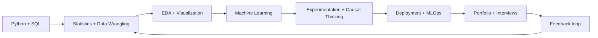

# Data Science Roadmap: Zero → Job-Ready → Advanced

  
  
  

<strong>خارطة طريق عملية ومنظمة لتعلّم Data Science من الصفر حتى بناء Portfolio قوي والاستعداد للإنترفيو.</strong>

Learn the concepts, build the projects, explain your decisions, and ship work that another person can reproduce.

> **The goal is not to finish a list of courses.** The goal is to become someone who can turn an ambiguous business question into a defensible, reproducible, and measurable data product.

## Contents

| Section | What you will find |
|---|---|
| [Roadmap](ROADMAP.md) | Five progressive levels, gates, weekly rhythm, and mastery checks |
| [Projects](PROJECTS.md) | Portfolio projects from exploratory analysis to production ML |
| [Interview Prep](INTERVIEW_PREP.md) | SQL, statistics, experimentation, ML, case study, and behavioral practice |
| [Companies](COMPANIES.md) | Target-company map, role families, and how to read job descriptions |
| [Resources](RESOURCES.md) | Free courses, documentation, datasets, books, and practice platforms |
| [Contributing](CONTRIBUTING.md) | How to improve the roadmap and add high-quality resources |

## The learning system

Each level has four outputs: **knowledge**, **evidence of practice**, **one explainable project**, and **a short reflection** describing what you would improve next. Do not advance because a playlist is complete; advance when you can pass the level gate in [ROADMAP.md](ROADMAP.md).

## Five levels at a glance

| Level | Focus | Minimum evidence |
|---|---|---|
| 0. Foundations | Python, Git, command line, basic math | 20 small Python exercises and one clean GitHub repo |
| 1. Analyst Core | SQL, pandas, cleaning, visualization, descriptive statistics | One end-to-end EDA with a written business memo |
| 2. ML Practitioner | supervised/unsupervised ML, validation, features, explainability | Two models with a leakage-safe evaluation and error analysis |
| 3. Production & Impact | APIs, testing, experiment design, deployment, monitoring | A reproducible model service or dashboard with documentation |
| 4. Advanced / Specialist | causal inference, time series, NLP, deep learning, scale | A specialization project with technical report and trade-offs |

## Start here

1. Read [ROADMAP.md](ROADMAP.md) and choose your current level using the diagnostic checklist.
2. Pick **one** project from [PROJECTS.md](PROJECTS.md); do not start with five projects at once.
3. Use [RESOURCES.md](RESOURCES.md) as a curated menu, not as a queue to consume.
4. Begin interview practice early with the weekly routine in [INTERVIEW_PREP.md](INTERVIEW_PREP.md).
5. Publish decisions, limitations, tests, and next steps—not only notebooks and accuracy scores.

## Portfolio quality standard

A strong project answers five questions clearly:

- What decision or user problem does this work support?
- What data-generating process and limitations should the reader know?
- Why was this method chosen over plausible alternatives?
- How was performance or usefulness evaluated without leakage?
- What would be required to operate, monitor, and improve it in the real world?

## Suggested weekly rhythm

| Day | Practice |
|---|---|
| 1 | Learn one concept and write a five-sentence explanation |
| 2 | Solve SQL/Python exercises without copying the answer |
| 3 | Apply the concept to a real dataset |
| 4 | Review assumptions, leakage, bias, and failure cases |
| 5 | Improve the README, tests, visualizations, or communication |
| 6 | Complete one timed interview set and review mistakes |
| 7 | Rest, reflect, and plan the next week |

## Important note

This roadmap is intentionally **tool-agnostic and evidence-driven**. Libraries change; the habits of framing, measurement, validation, communication, and responsible deployment last longer. All external links are listed with their source and purpose in [RESOURCES.md](RESOURCES.md).

## References

[1]: https://www.kaggle.com/learn "Kaggle Learn"
[2]: https://developers.google.com/machine-learning/crash-course "Google Machine Learning Crash Course"
[3]: https://scikit-learn.org/stable/user_guide.html "scikit-learn User Guide"
[4]: https://learn.microsoft.com/en-us/training/career-paths/data-scientist "Microsoft Learn: Training for Data Scientists"
[5]: https://www.amazon.jobs/content/en/job-categories/data-science "Amazon Jobs: Data Science"

## License

Released under the MIT License. See [LICENSE](LICENSE).
